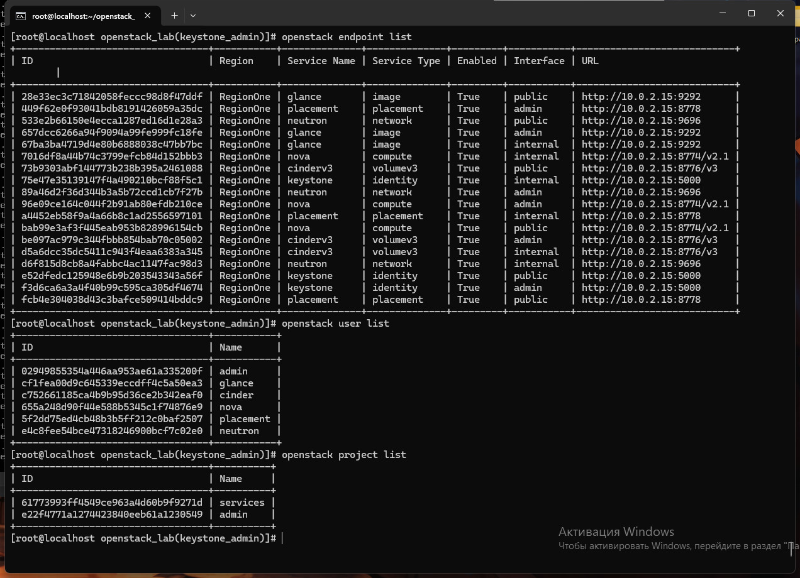

# Отчёт по лабораторной работе

## Цель работы

Целью лабораторной работы является установка и настройка виртуальной машины (ВМ) на базе Alma Linux для развертывания сервиса облачной инфраструктуры OpenStack, настройка необходимых параметров для работы OpenStack и знакомство с основными командами и функциями веб-интерфейса _Horizon_.

## Ход работы

### Шаги выполнения:

1. **Создание ВМ и настройка её параметров**

   - Виртуальная машина создана в VirtualBox на базе образа [AlmaLinux-9.3-x86_64-minimal.iso](https://repo.almalinux.org/almalinux/9.3/isos/x86_64/AlmaLinux-9.3-x86_64-minimal.iso).
   - Настроены параметры по рекомендациям: 4 ГБ ОЗУ, 20+ ГБ HDD, 2-4 виртуальных ядра CPU и сеть в режиме NAT.
   - Установлен IP адрес ВМ.
   - Настроен проброс портов для доступа по SSH и через веб-интерфейс.

   

2. **Подключение к ВМ и установка git**

   - Подключение к ВМ выполнено успешно по SSH.
   - Установлен git командой `dnf install git -y`.

3. **Клонирование и подготовка проекта**

   - Проект склонирован из репозитория [itmo_samon/openstack_lab.git](https://gitlab.com/itmo_samon/openstack_lab.git).
   - Выполнен скрипт `./prepare.sh` для начальных настроек.

4. **Настройка OpenStack**

   - Изучен скрипт `config.sh`, который выполняет конфигурирование ответного файла `answer.cfg`.
   - Выполнен `config.sh` для подготовки к установке OpenStack.

5. **Установка OpenStack**

   - Установка OpenStack выполена с помощью команды `packstack --answer-file=answer.cfg`, что заняло около 30-40 минут.

   

6. **Получение данных для входа в систему**

   - Содержимое файла `~/keystonerc_admin` изучено для получения логина и пароля.

   

7. **Аутентификация и изучение сервисов OpenStack**

   - Исполнение `source ~/keystonerc_admin` для помещения данных для входа в переменные среды.
   - Получение списка эндпоинтов и пользователей OpenStack.

   

8. **Работа с проектами**

   - Создан новый проект `demo` с помощью команды `openstack project create`.
   - Получен обновленный список проектов для подтверждения создания.

   

9. **Работа с веб-интерфейсом Horizon**

   - Вход в веб-панель Horizon осуществлен успешно.
   - В интерфейсе выполнено создание проекта и пользователя проекта, а также назначение роли пользователю.

   

## Выводы

В ходе лабораторной работы были изучены основы работы с OpenStack, выполнена установка и начальная настройка облачной инфраструктуры. Получены навыки работы с командной строкой для управления OpenStack и пользования веб-интерфейсом Horizon для административных задач.
