# Отчет по лабораторной работе №2

## Ход работы:

### Создание сетей и подключение к ним

1. **Создание сети провайдера**

   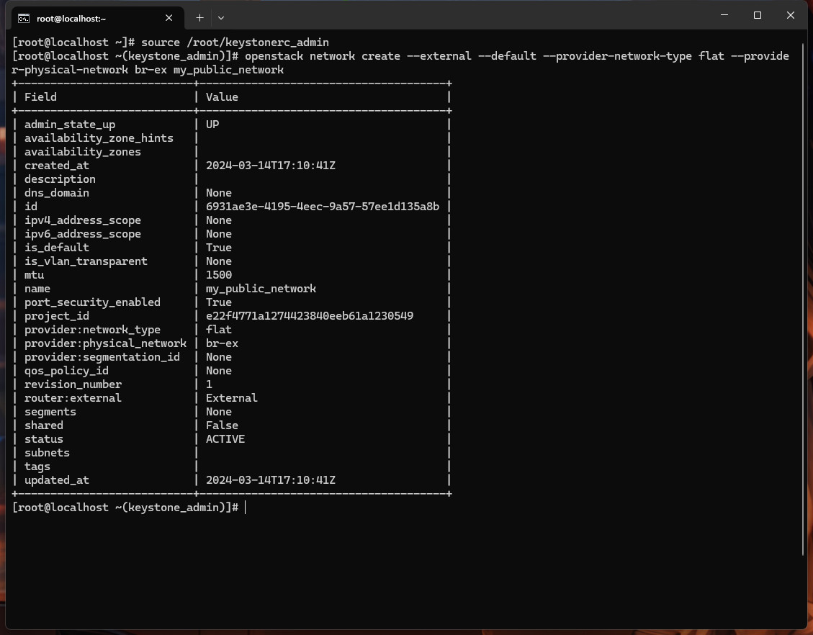

2. **Создание подсети в сети провайдера**

   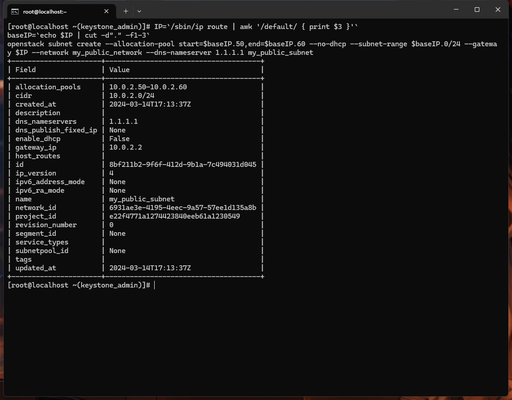

3. **Создание локальной сети и подсети**

   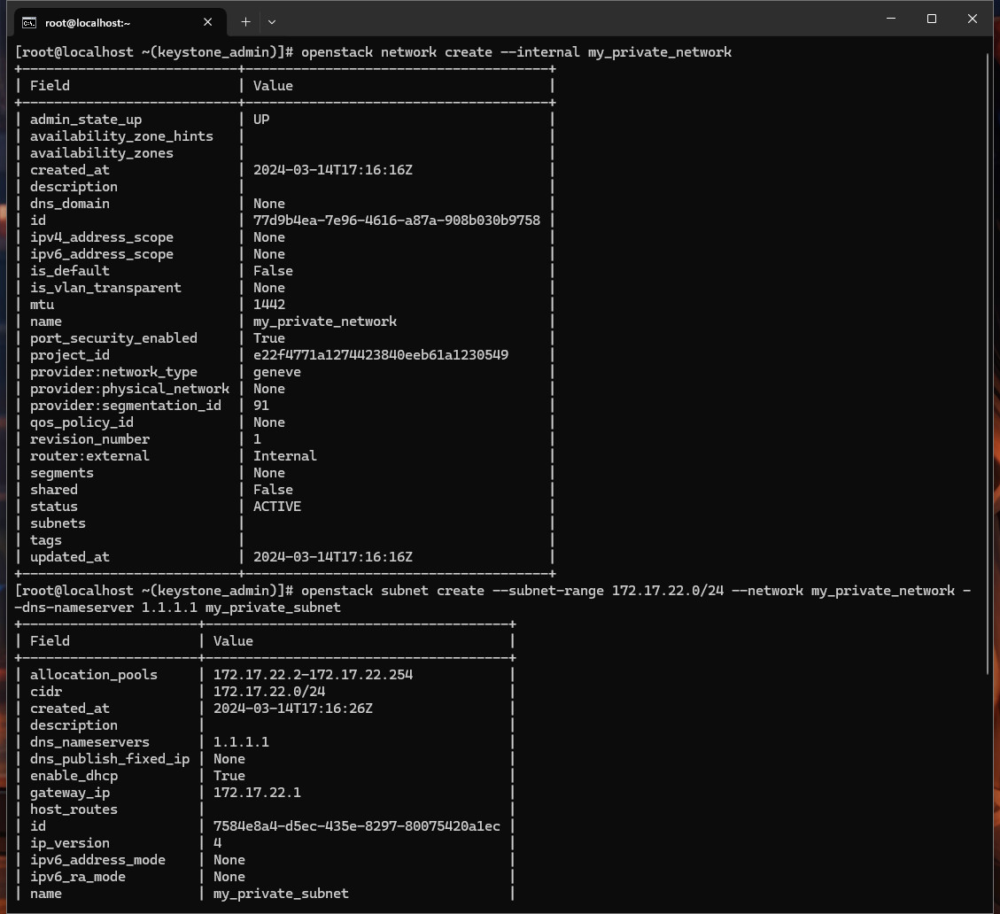

4. **Создание роутера и подключение созданных сетей**

   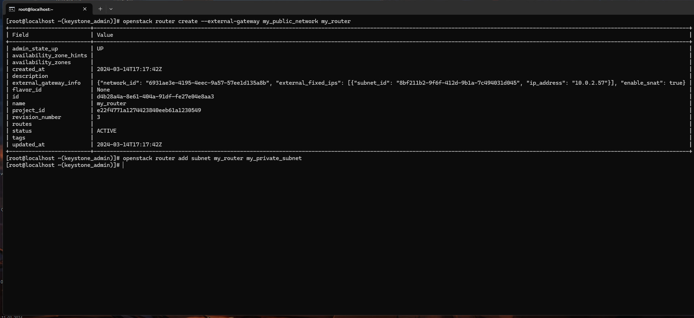

### Создание и настройка виртуальной машины

5. **Создание флейвора виртуальной машины и создание ключа доступа**

   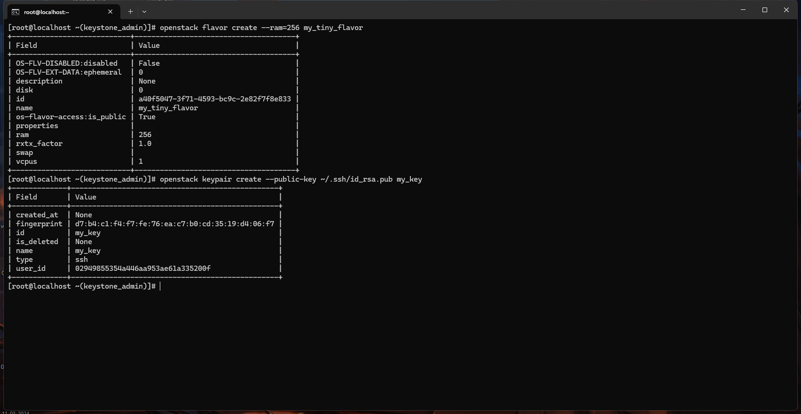

6. **Загрузка образа Cirros в OpenStack Glance**

   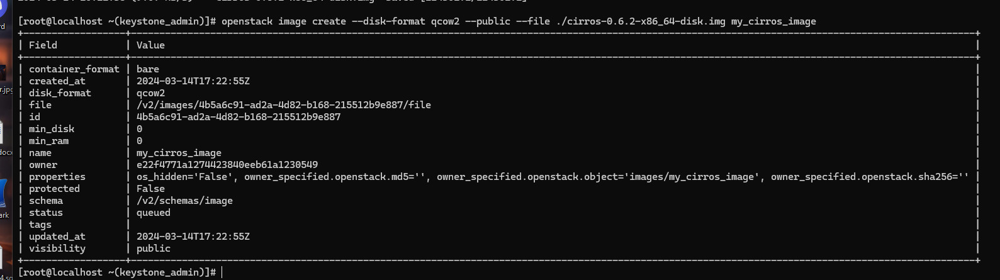

7. **Создание блочного устройства в Cinder**

   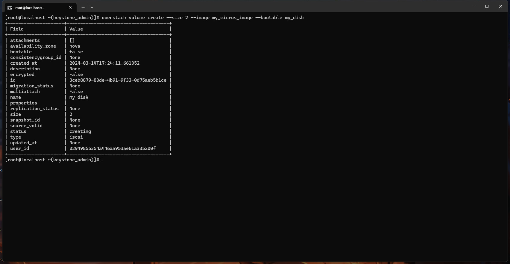

8. **Создание виртуальной машины через Horizon**

   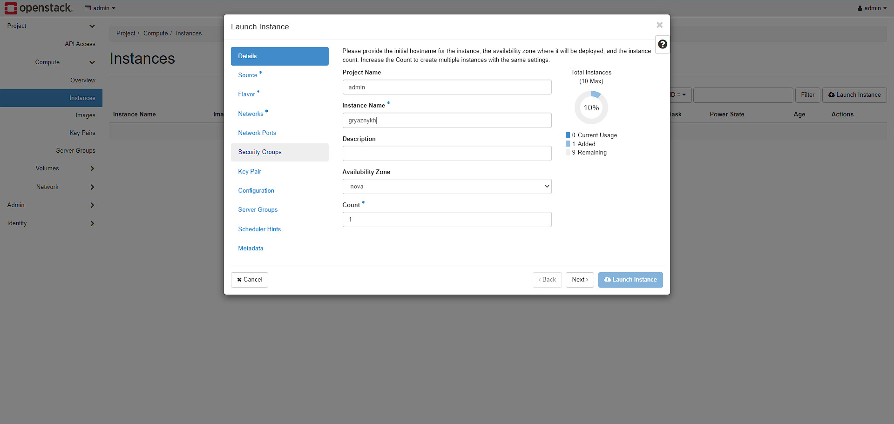

   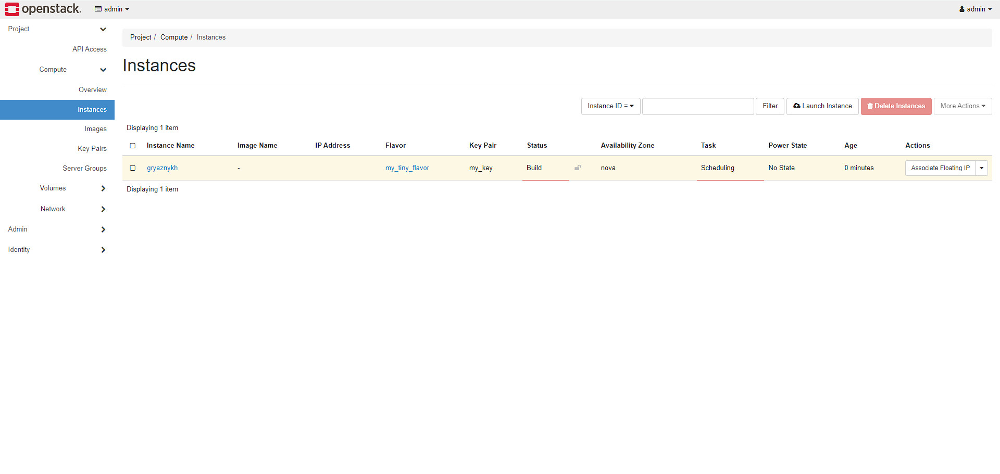

   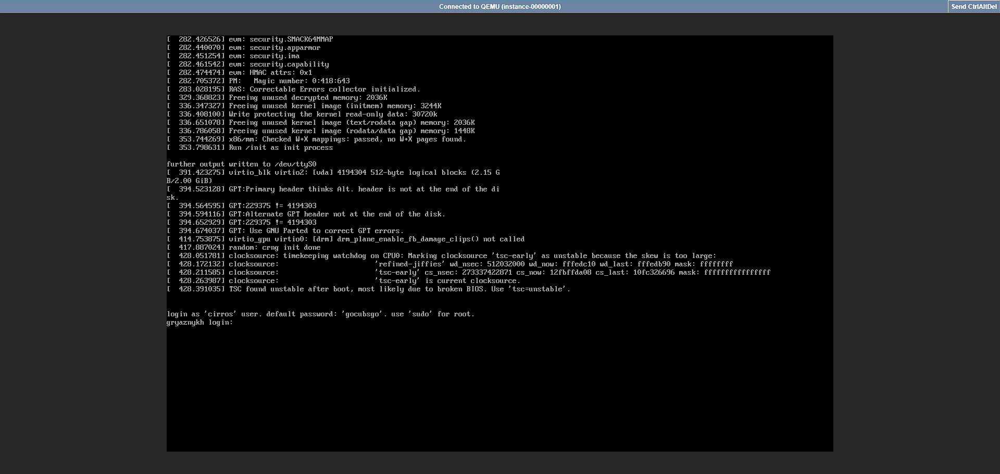

### Дополнительные задания

9. **Создание новой приватной сети и подключение к роутеру**

    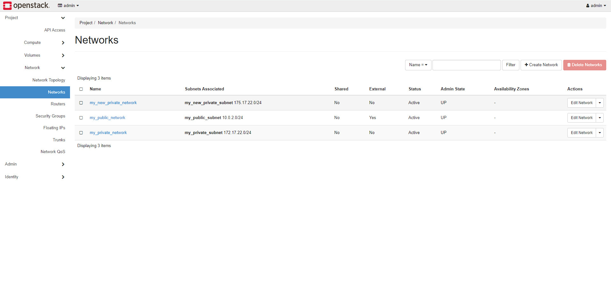
    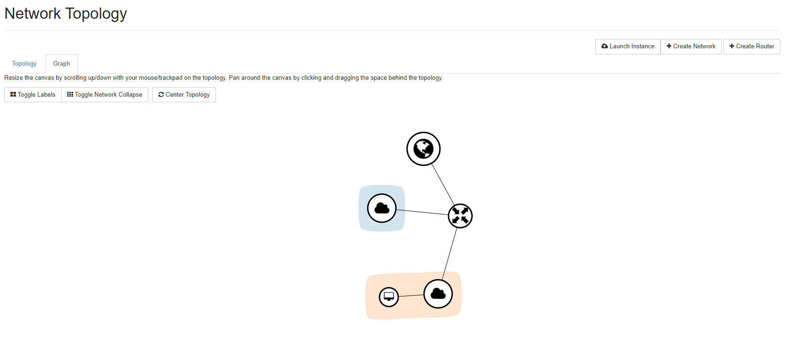

10. **Создание копии блочного устройства через CLI**

    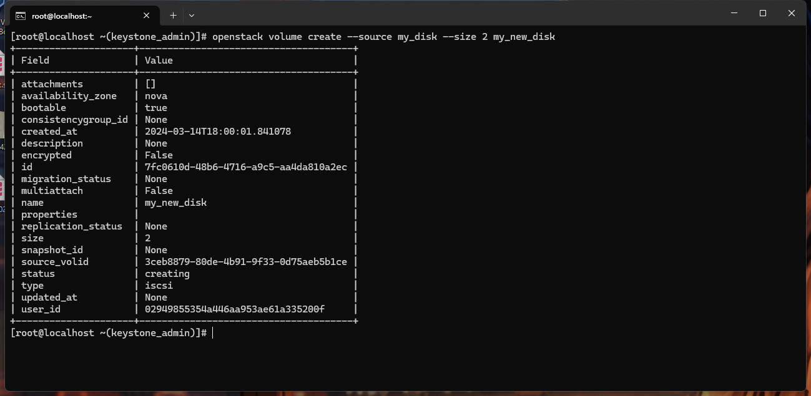

11. **Создание второй виртуальной машины через CLI**

    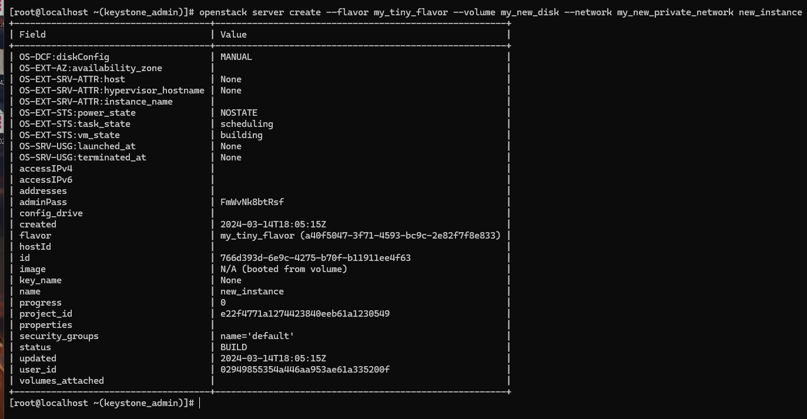

12. **Проверка состояния инстанса**

    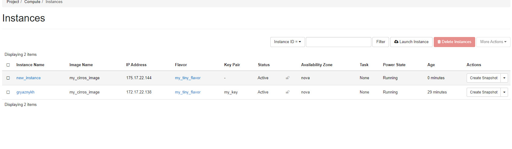

### Результаты

- Созданы публичные и приватные сети.
- Создан и присвоен флейвор.
- Создано и подключено блочное устройство.
- Созданs рабочие инстансы.

### Вопросы

1. **Что именно сервис с помощью Keystone проверяет в токене пользователя?**

   Сервис с помощью Keystone проверяет подлинность токена, его актуальность (не истек ли срок действия), а также соответствие прав доступа пользователя для выполнения запрашиваемой операции.

2. **К эндпоинту какого сервиса Nova идет следом после Keystone?**

   После Keystone, Nova обычно обращается к сервису Glance для получения образов ВМ или к сервису Neutron для настройки сетевых интерфейсов, в зависимости от контекста операции, которую она выполняет.