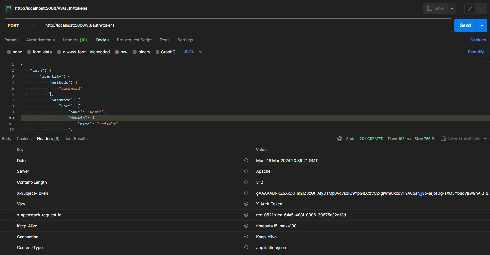
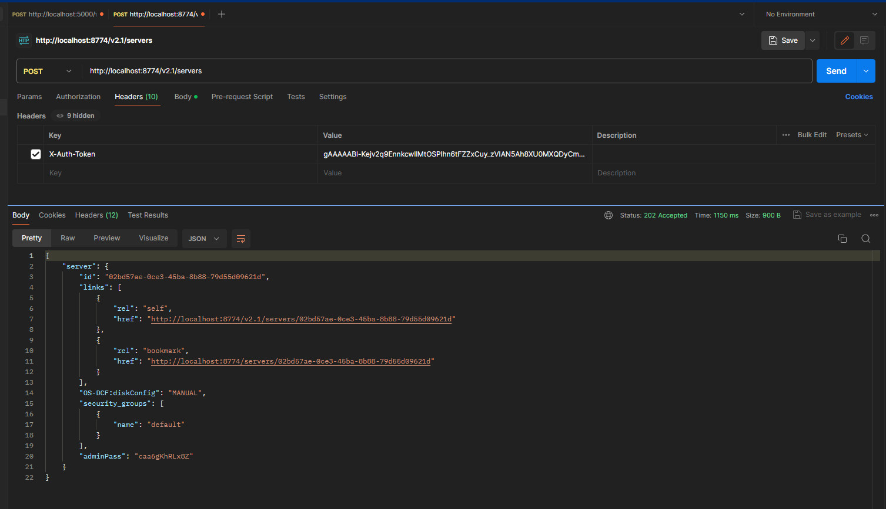
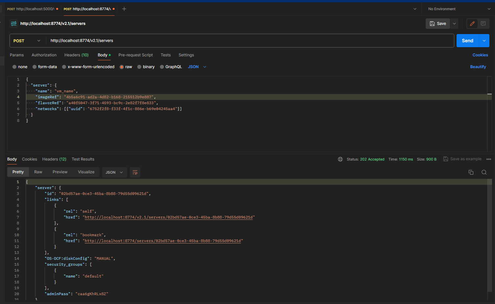
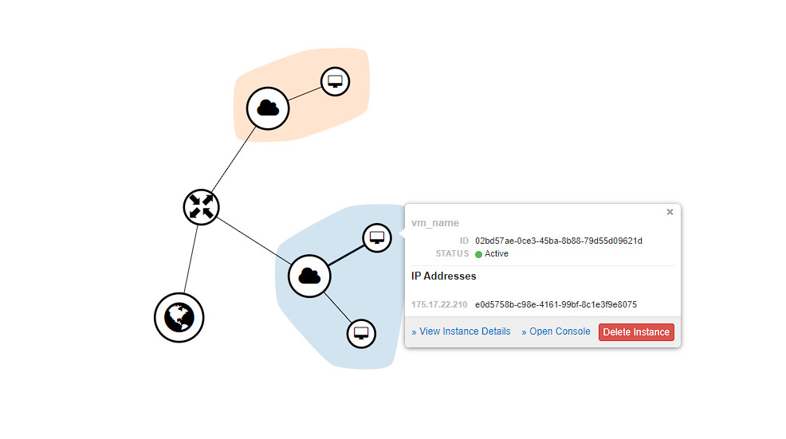
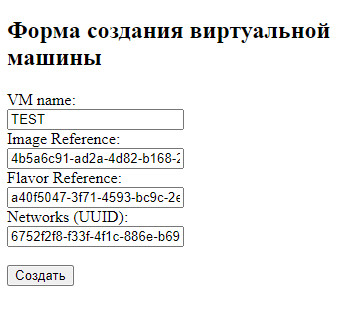
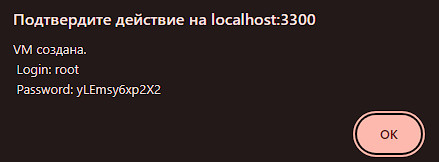
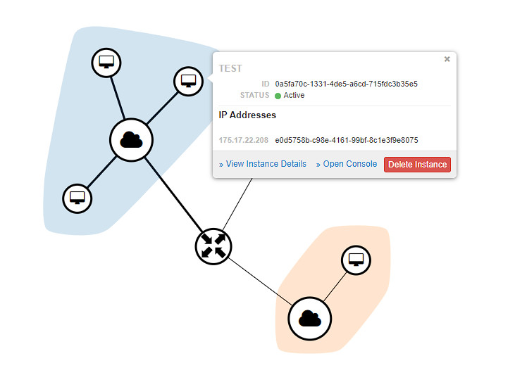

# Отчет по лабораторной работе №3

## Ход работы:

### Создание виртуальной машины через Nova API 

1. **Получение ключа доступа**

   

2. **Проверка ключа и создании виртуальной машины**

   
   
   

3. **Создание веб формы заказа виртуальной машины**

   

   На реальных проектах вместо uuid используется label, но для упрощения формы в учебных явно передаем uuid ресурсов.

4. **Данные для подключения к машине**

   

5. **Машина была успешно создана для клиента**

   

   Исходный код простейшего сервера и формы лежит по пути laba3/app.

### Вопросы

1. **Какие протоколы тунеллирования использует Neutron?**

   Neutron может использовать различные протоколы тунелирования, включая VXLAN, GRE и Geneve. Эти протоколы позволяют создавать виртуальные сети и обеспечивать изоляцию между виртуальными машинами. Выбор конкретного протокола туннелирования зависит от конфигурации и требований среды.

2. **Можно ли заменить Cinder, например, CEPH-ом? Для чего если да, почему если нет?**

   Да, можно заменить Cinder на CEPH. Замена Cinder на CEPH может быть полезной, если требуется более гибкое и масштабируемое хранилище для виртуализированных сред, так как CEPH позволяет объединять несколько узлов хранения в единое хранилище с общим доступом к данным и автоматическим восстановлением после отказов.